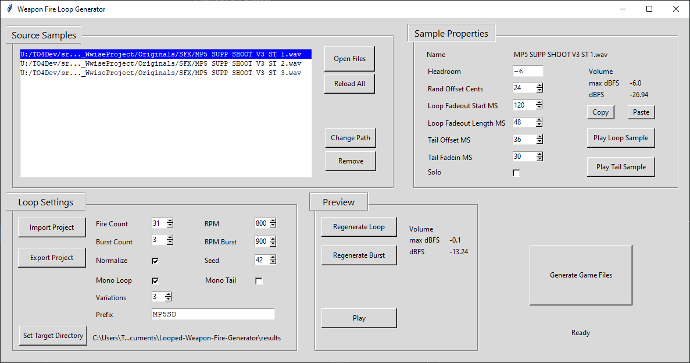

# Looped-Weapon-Fire-Generator
Creates looped weapon fire sounds from oneshot samples.
 
## Dependencies
```
pip install pydub
pip install numpy
```  
Sound playback only supported on windows.  
## Run
```
python weapon_fire_loop_generator.py
```
